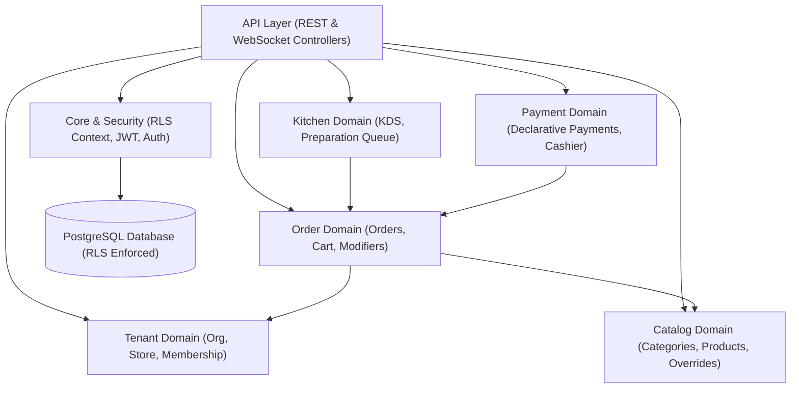
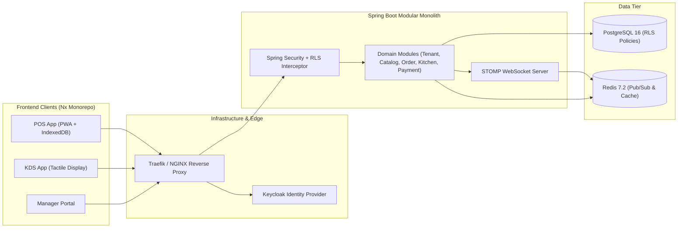

# Architecture Spine — RestoOS

## Design Paradigm

RestoOS relies on a **Modular Monolith** architecture for the backend paired with an **Nx Monorepo** for the frontend.

### Backend Package Dependency Hierarchy



## Invariants & Rules

### AD-1 — System Architecture Paradigm

- **Binds:** All backend services & business domain capabilities.
- **Prevents:** Distributed transaction complexity, saga management overhead, and microservice network latency across core order flows.
- **Rule:** The backend must be constructed as a Spring Boot Modular Monolith with strict Java package isolation (`com.resto.tenant`, `com.resto.catalog`, `com.resto.order`, `com.resto.kitchen`, `com.resto.payment`, `com.resto.audit`). Cross-domain communication occurs strictly via published domain interfaces or Spring ApplicationEvents.

### AD-2 — Frontend Monorepo & Component Standard

- **Binds:** All frontend web applications (`pos-app`, `kds-app`, `admin-portal`) and shared libraries.
- **Prevents:** Monolithic JavaScript client bundles on low-powered POS/KDS hardware; inconsistent UI/UX behaviors.
- **Rule:** Frontend applications must be housed within an Nx Monorepo split into dedicated applications (`pos-app`, `kds-app`, `admin-portal`) sharing `@resto/data-access` and `@resto/ui-components`. All Angular components must retain `standalone: false` in their `@Component` decorator metadata.

### AD-3 — Multi-Tenant Row-Level Security (RLS) Isolation

- **Binds:** All tenant-scoped database tables and JPA repositories.
- **Prevents:** Cross-tenant data leakage across organizations sharing the same PostgreSQL database schema.
- **Rule:** Every tenant-owned database table must include `organization_id UUID NOT NULL` (and `store_id UUID` where store-specific). Client requests must never specify tenant IDs in query parameters. The backend security interceptor extracts tenant context from verified JWT claims and sets PostgreSQL transaction parameters (`SET LOCAL app.current_org_id = ...` and `SET LOCAL app.current_store_id = ...`) before executing SQL queries.

### AD-4 — Store-Scoped Real-Time STOMP WebSocket Messaging

- **Binds:** Real-time KDS kitchen order updates and POS status synchronizations.
- **Prevents:** High latency polling and cross-store notification leaks.
- **Rule:** Real-time communications must use Spring WebSocket STOMP over SockJS scoped strictly to store topics (`/topic/store/{storeId}/kitchen` and `/topic/store/{storeId}/pos`). A Redis Pub/Sub backplane handles broker broadcasting across horizontally scaled backend instances.

### AD-5 — Offline Creation Keys & Request Idempotency

- **Binds:** Offline POS order drafting, client creation, and payment recording.
- **Prevents:** Duplicate order creation during intermittent local Wi-Fi / WAN drops.
- **Rule:** Locally created entities in offline mode must use client-side generated UUID strings as temporary primary keys. All critical mutation endpoints (`POST /api/orders`, `POST /api/payments`) must require an `Idempotency-Key` HTTP header. Upon server synchronization, the backend verifies idempotency in Redis/DB and returns the permanent server-assigned ID replacing the local client UUID.

### AD-6 — Standardized API Response Envelope

- **Binds:** All REST API controllers across all backend modules.
- **Prevents:** Non-standard payload structures and inconsistent frontend HTTP response parsing.
- **Rule:** All HTTP API responses must be wrapped using the standardized response builder format:
`Response.builder().status(HttpStatus).statusCode(int).message(String).service("RESTO-OS").data(Object).build()`

## Consistency Conventions

| Concern | Convention |
| --- | --- |
| Naming | Snake_case for database tables/columns (`organization_id`, `created_at`); CamelCase for Java/TypeScript properties; kebab-case for REST URIs (`/api/catalog/store-products`). |
| Data & Formats | UUIDs for entity primary keys; ISO-8601 UTC strings (`2026-09-08T12:00:00Z`) for timestamps; decimal numeric for currency (`12.50`). |
| State & Cross-Cutting | Transactional RLS interceptor sets DB session parameters; JWT validation at Spring Security filter level; Argon2id hashing for PIN auth; JSON structured logging with `trace_id`, `organization_id`, `store_id`. |

## Stack

| Name | Pinned Version |
| --- | --- |
| Java | 21 |
| Spring Boot | 3.3.x |
| Angular | 18.x |
| Nx Monorepo | 19.x |
| PostgreSQL | 16.x |
| Keycloak | 24.x |
| Redis | 7.2 |
| Liquibase | 4.x |
| Docker / Docker Compose | 26.x |

## Structural Seed

### System Topology



### Source Tree Layout

```text
RestoOS/
├── apps/
│   ├── pos-app/                # Angular POS PWA application
│   ├── kds-app/                # Angular Kitchen Display application
│   └── admin-portal/           # Angular Management & Organization Portal
├── libs/
│   ├── core/                   # Auth, HTTP interceptors, RLS context, WebSocket services
│   ├── data-access/            # Shared Angular state, models, and API clients
│   └── ui-components/          # Shared design system components (standalone: false)
└── backend/
    └── src/main/java/com/resto/
        ├── core/               # Security, PostgreSQL RLS interceptor, Response envelope
        ├── tenant/             # Organization, Store, User, Membership, Roles
        ├── catalog/            # Categories, Central/Store Products, Overrides, 86 status
        ├── order/              # Dine-in/Takeaway Orders, Cart, Modifiers, Idempotency
        ├── kitchen/            # KDS Ticket Queue, Preparation Timers, WebSocket Dispatcher
        ├── payment/            # Declarative Payment, Cashier Audit, Daily Closure
        └── audit/              # Operations & Change Audit Logging
```

## Capability → Architecture Map

| Capability / Area | Lives in | Governed by |
| --- | --- | --- |
| Multi-tenant & Identity | `com.resto.tenant` & `apps/admin-portal` | AD-1, AD-3 |
| Catalog & Price Overrides | `com.resto.catalog` & `apps/admin-portal` | AD-1, AD-3, AD-6 |
| POS Touch Ordering & Cart | `com.resto.order` & `apps/pos-app` | AD-1, AD-2, AD-5, AD-6 |
| KDS Real-time Preparation | `com.resto.kitchen` & `apps/kds-app` | AD-1, AD-2, AD-4 |
| Declarative Payment & Audit | `com.resto.payment` & `apps/pos-app` | AD-1, AD-5, AD-6 |

## Deferred

| Item | Reason for Deferral |
| --- | --- |
| Electronic Payment Terminal (EMV) SDK Integration | Scope for V2 (MVP relies on declarative Cash/Card marking). |
| External Delivery Aggregators (UberEats, Deliveroo) | Scope for V2; API webhooks deferred. |
| Click & Collect Web Portal | Scope for V2; core internal order engine specified first. |
| Advanced BI / Predictive Analytics | Scope for V2; MVP includes operational daily dashboard only. |
