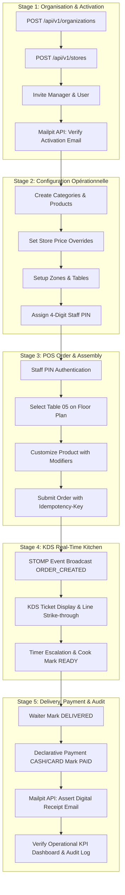

# 🧪 RestoOS — Golden Path E2E Test Suite Architecture & Specification

> **Auteur :** Murat — Master Test Architect & Quality Advisor (`🧪`)  
> **Date :** 8 Septembre 2026  
> **Portée :** Validation E2E du Golden Path complet — Provisioning Multi-Tenant, Catalog & Configuration, Prise de commande POS, KDS Cuisine Temps Réel, Livraison & Paiement, Intégration Mailpit SMTP/REST.  
> **Cible de performance :** Suite de test zéro flakiness, déterministe, s'exécutant en < 45 secondes en pipeline CI/CD.

---

## 1. Vision & Architecture de la Suite E2E

La suite de tests E2E **Golden Path** valide le cycle de vie applicatif complet de **RestoOS** à travers toutes les couches du système (Frontend Angular, Backend Spring Boot, WebSocket STOMP, Base de données PostgreSQL RLS, et Serveur de Mails Mailpit).



---

## 2. Infrastructure Mailpit pour le Test d'Emailing

Pour intercepter et valider l'envoi des emails (invitations d'utilisateurs, notifications de bienvenue, reçus de paiement numériques), la suite utilise **Mailpit** (alternative moderne et ultra-rapide à MailHog/MailDev).

### Services Docker Compose (`docker-compose.test.yml`)
- **Port SMTP :** `1025` (Utilisé par Spring Boot `spring.mail.port`)
- **Port HTTP REST/UI :** `8025` (Utilisé par le client de test E2E `MailpitClient`)

---

## 3. Fichiers et Structure de la Suite E2E

- [`docker-compose.test.yml`](file:///c:/Users/kahonsu/Documents/GitHub/RestoOS/docker-compose.test.yml) : Infrastructure de test (PostgreSQL, Mailpit, Redis, Keycloak)
- [`frontend/e2e/playwright.config.ts`](file:///c:/Users/kahonsu/Documents/GitHub/RestoOS/frontend/e2e/playwright.config.ts) : Configuration Playwright E2E
- [`frontend/e2e/helpers/mailpit.client.ts`](file:///c:/Users/kahonsu/Documents/GitHub/RestoOS/frontend/e2e/helpers/mailpit.client.ts) : Client REST TypeScript pour l'API Mailpit
- [`frontend/e2e/fixtures/test-fixtures.ts`](file:///c:/Users/kahonsu/Documents/GitHub/RestoOS/frontend/e2e/fixtures/test-fixtures.ts) : Fixtures de test personnalisées avec auto-cleanup
- [`frontend/e2e/pages/admin-portal.page.ts`](file:///c:/Users/kahonsu/Documents/GitHub/RestoOS/frontend/e2e/pages/admin-portal.page.ts) : Page Object Admin Portal
- [`frontend/e2e/pages/pos-terminal.page.ts`](file:///c:/Users/kahonsu/Documents/GitHub/RestoOS/frontend/e2e/pages/pos-terminal.page.ts) : Page Object POS Touch Terminal
- [`frontend/e2e/pages/kds-screen.page.ts`](file:///c:/Users/kahonsu/Documents/GitHub/RestoOS/frontend/e2e/pages/kds-screen.page.ts) : Page Object KDS Kitchen Display System
- [`frontend/e2e/specs/golden-path.spec.ts`](file:///c:/Users/kahonsu/Documents/GitHub/RestoOS/frontend/e2e/specs/golden-path.spec.ts) : Spec E2E Golden Path complet

---

## 4. Guide d'Exécution

```bash
# 1. Démarrer l'environnement de test avec Mailpit
docker-compose -f docker-compose.test.yml up -d

# 2. Exécuter la suite E2E Golden Path avec Playwright
cd frontend
npx playwright test e2e/specs/golden-path.spec.ts --project=chromium --headed

# 3. Consulter les emails interceptés sur l'interface Mailpit
open http://localhost:8025
```
